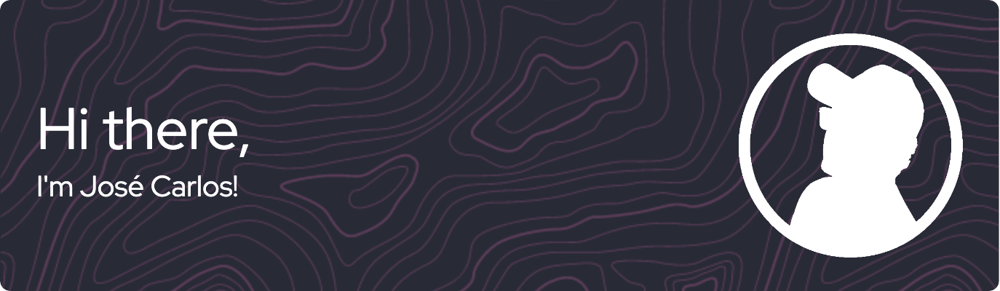

<h2> 🚀 About Me </h2>

I’m a Computer Science and Technology student from México 🇲🇽, I love all things related to technology, I’m also a big fan of the open source community, and I’m always trying to learn new things. My main interests are in the field of software development, but I’m also interested in the fields of cybersecurity and design. At the moment my main focus is improving my skills as a developer, I’m always looking for new challenges, opportunities, and new ways to learn and grow.

- 💬 Ask me about anything!
- 😄 Pronouns: He/Him
- ⚡ Fun fact: I can solve a Rubik's Cube in under 30 seconds!

<h2>📊 My GitHub Stats</h2>
<table><tr><td valign="top" width="50%">

</td><td valign="top" width="50%">

</td></tr></table>

<h2>  Skills  </h2>

    

<h2>  Stuff I worked on last week  </h2>

 

<h2> Connect with me </h2>

